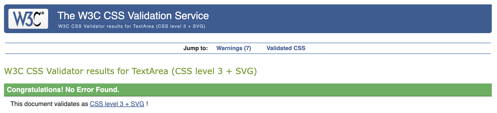

# Milestone Project 1- Memory card game using HTML, CSS and JavaScript

# Menu of contents
## 1. Deployment 
### 1. Live Site Link
### 2. Responsiveness Screenshots
## 2. Purpose of Project
## 3. User Stories
### 1. Must Haves
### 2. Should Haves
### 3. Could Haves
## 4. UX Design
## 5. UI Design
## 6. Testing
### 1. Coding Validation
### 2. Bugs Found and Resolved
## 7. Next Step Features
## 8. Coding Sources
## 9. Media sources
## 10. Acknowledgements
__________________
__________________
## 1. Deployment 
 Project was deployed using GitHub and Visual Studio.

### 1. Live Site
https://tlc-1990.github.io/Milestone-2-Project/

(https://ui.dev/amiresponsive)

### 2. Responsiveness Screenshots
## 2. Purpose
To create an engaging and educational game to test a user's memory through flipping a series of cards to create matching pairs. 

## Criteria provided by Code Institute 
 
### External user’s goal: 
* Have fun playing the game.

### Site owner's goal:
* Same as the external users - make a game that you'd enjoy playing yourself.

### Features to include:

* Build a simple single-player pattern-matching memory game.

* We encourage you to create your own game, by choosing a set of visual and/or auditory patterns that increase in complexity over the course of the game and challenge the player. Games that you could look at for inspiration include Simon and Bop It.

* Provide users with clear explanations on how to play the game and with clear feedback on how they're doing at any stage

### User stories
* As a user, I want to play an engaging game that tests my memory. 
* As a user, I want the website to be simply presented and easily navigable. 
* As a user, I want feedback when I complete the game. 
* As a user, I want to be able to reset the game in order to play again without having to refresh the page. 
### 1. Must-haves
* User friendly navigation.
* Functional card-matching themed memory game that works on multiple devices. 
* Clear instructions for the user. 
* Feedback message on winning. 
* Button to reset the game in order for user to play again. 

### 2. Should-haves
* Splash screen confirmation ahead of user viewing game. 
* Engaging visual design

### 3. Could-haves
* Timer element or attempt counter to increase competitive element. 
* Audio and/or messages when a correct or incorrect choice is made. 

## 4. UX Design

### Strategy
The aim of the project is to create a functional and engaging game through the use of HTML, CSS and JavaScript. 

The user will be able to use the game and recieve feedback once the game is completed. 

### Scope
The project will consist of a single page, but the game will be preempted by a starting splash page. 
1. Homepage - Following a user's confirmation that they want to start playing the game, they will be taken to the main game page. This will contain a title, user instructions and the interactive memory card game. The game will focus on matching pairs of images of extinct megafauna. 
### Structure
(See wireframes section below)

### Skeleton
The user will navigate by clicking the home link in the navbar menu (visible in tablet view and on desktop, collapsed on mobile devices).
The active page will be highlighted in the navbar. This will prevent the user needing to use the refresh or back button on their browser. 

### Surface
My aim was to keep the font choices fun but readable and invoked a game theme. As the game relates to prehistoric megafauna, the website's colourscheme will match this with an earthy/jungle theme. 

The smaller text of the site will be #FDE4A1 (peach crème brûlée) against the contrasting background of #345030 (palm leaf) to allow for readability. Large text will be #DAF033 (lime fizz).

 

(https://imagecolorpicker.com/ used to create palettes)
#### Fonts

Title font ("Bungee Shade", sans-serif)

Paragraph font ("Grandstander", cursive)

## 5. UI Design
## Initital design wireframes created using Balsamiq

### Mobile view

### Tablet view

### Desktop view

## 6. Testing 

Website checked on Safari and on Chrome on desktop and on IOS (Apple mobile). No bugs observed between browsers. 

W3C Markup Validation Service 
(https://validator.w3.org/) used for HTML validation

Homepage (index.html)

W3C CSS validation service
(https://jigsaw.w3.org/css-validator/) used for CSS validation.

JSHint JavaScript validation service
(https://jshint.com/) used for JS validation 

Lighthouse scores

Homepage (index.html)

Mobile scores

Desktop scores

Contrast and visibility issue with 'font generator' link recognised, but element is not part of the game and does not interfere with site interaction. 

### 2. Bugs Found and Resolved
1.  'const board = document.getElementById('game-board');' used in game logic was overlapping with wholeGameboardArea constant previously called at start of script.js. Unecessary const board removed and wholeGameboardArea used in its place. 
2.  Unclear declarations and functions to create card arrays prevented game logic from functioning. Removed all offending code and worked through logically. 
3. Spillover JavaScript in HTML caused issue with 'click' event listeners. onClick() HTML events prevented JS responsitvity. 

## 7. Next Step Features	

I would add a timer or a attempt number counter to the game to improve the competitive element. I would also like to add soundeffects to successful and unsuccessful moves. 

If I could have, I would have also liked to have added a second page which would have provided the user with information about the animals involved in the game and links for the them to learn more. (see Balsamiq preview below)

## 8. Coding Sources
* Code taken from Bootstrap v5.0 and heavily adapted/edited to fit needs of site (NavBar, buttons)
* Code Institute lessons - Code copied to prevent navbar collapse issue (Highlighted in boardwalk games project) 
* Favicon was used to create the icon in page head.
* Balsamiq was used to create wireframes
* Responsive Viewer Chrome add-on was used for responsiveness screenshots

JavaScript

checkForWin() fuction- https://daynya.com/memory.html

Fisher-Yates shuffle - https://www.geeksforgeeks.org/shuffle-a-given-array-using-fisher-yates-shuffle-algorithm/ 

classList add and remove classes for start screen button and card flip funtion in game - https://sentry.io/answers/how-can-i-change-an-elements-class-with-javascript/#:~:text=toggle()%20method%20that%20will,class%20will%20only%20be%20removed.

Data cards /data sets for card identification  - https://developer.mozilla.org/en-US/docs/Web/API/HTMLElement/dataset

DOMcontentloaded https://developer.mozilla.org/en-US/docs/Web/API/Document/DOMContentLoaded_event

AI system consulted to assist with resetGame bug as cards were not returning to unflipped position in order to start new game. 

## 9. Media Sources
<table>
  <caption>
    Animal and background images
  </caption>
  <thead>
    <tr>
      <th scope="col">Photo Title</th>
      <th scope="col"> Relative Path </th>
      <th scope="col">Source Link</th>
      <th scope="col">Page Location</th>
    </tr>
  </thead>
  <tbody>
    <tr>
      <th scope="row">glyptodon.webp</th>
      <td>assets/images/glyptodon.webp</td>
      <td>https://commons.wikimedia.org/
https://upload.wikimedia.org/wikipedia/commons/8/8b/Glyptodon_des_cavernes.jpg?20080105201428</td>
      <td>index.html</td>
    </tr>
     <tr>
      <th scope="row">irish-elk.webp</th>
      <td>assets/images/irish-elk.webp</td>
      <td>https://static.wikia.nocookie.net/novum-terram/images/7/79/Irish_elk_%28SciiFii%29.png/revision/latest?cb=20200613190945</td>
      <td>index.html</td>
    </tr>
    <tr>
      <th scope="row">megatherium.webp</th>
      <td>assets/images/megatherium.webp</td>
      <td>https://www.nhm.ac.uk/content/dam/nhm-www/discover/what-was-megatherium/megatherium-full-width.jpg</td>
      <td>index.html</td>
    </tr>
     <tr>
      <th scope="row">short-faced-bear.webp</th>
      <td>assets/images/short-faced-bear.webp</td>
      <td>https://static.wikia.nocookie.net/sciifii/images/d/dd/Short-faced_bear_%28SciiFii%29.png/revision/latest?cb=20210121201358</td>
      <td>index.html</td>
    </tr>
     <tr>
      <th scope="row">smilodon.webp</th>
      <td>assets/images/smilodon.webp</td>
      <td>https://pixabay.com/illustrations/smilodon-saber-toothed-cat-extinct-7540040/
https://pixabay.com/get/g982aa77da75e15aca5adcf8215c5dc0bf3a00a4c45c2f681da68f07f69f3517093e17d60b5d484524f2bd3e013270144b13f956e441d26536c1d3011e6ad72a85875cf7bbeecaf6ca4b876e02626f6e3_1280.png?attachment=</td>
      <td>index.html</td>
    </tr>
     <tr>
      <th scope="row">steppe-bison.webp</th>
      <td>assets/images/steppe-bison.webp</td>
      <td>https://img.freepik.com/free-psd/majestic-european-bison-charging_191095-79184.jpg?t=st=1746747659~exp=1746751259~hmac=5f4bf4059462af3f0e40e32322aa9d241946e227475bd9a715b7418229b04ff6&w=1380</td>
      <td>index.html</td>
    </tr>
    <tr>
      <th scope="row">titanis.webp</th>
      <td>assets/images/titanis.webp</td>
      <td>https://64.media.tumblr.com/8d91c3bbaf5c8392718a4f4278218b96/aa505d15e123d588-0d/s1280x1920/1942164659a6d62ce04cffba1496705cd0a52fe5.png</td>
      <td>index.html</td>
    </tr>
    <tr>
      <th scope="row">woolly-mammoth.webp</th>
      <td>assets/images/woolly-mammoth.webp</td>
      <td>https://pixabay.com/illustrations/woolly-mammoth-mammoth-nature-9271976/
https://pixabay.com/get/g199a2d5535bdd0c66f994830e4545c6ecc3a73c07084c882ed3b2123c3e63a1137062518dc6499e175ba4daf21d83073a9cb967ace9cc718e0d4601e29a473968f46c9d5e3c067cfb03c5c683cdb8c54_1280.png?attachment=</td>
      <td>index.html</td>
    </tr>
    <tr>
      <th scope="row">ferns.webp</th>
      <td>assets/images/ferns.webp</td>
      <td>https://images.pexels.com/photos/2757549/pexels-photo-2757549.jpeg?</td>
      <td>index.html</td>
    </tr>
  </tbody>
</table>

## 10. Acknowledgements 
* Dr Raghav Kovvuri (HE Lecturer- Computing at University Centre of Peterborough) for support and advice throughout the course. 
* Iuliia Konovalova, my wonderful, knowledgeable mentor. Sorry again about the timer! 

